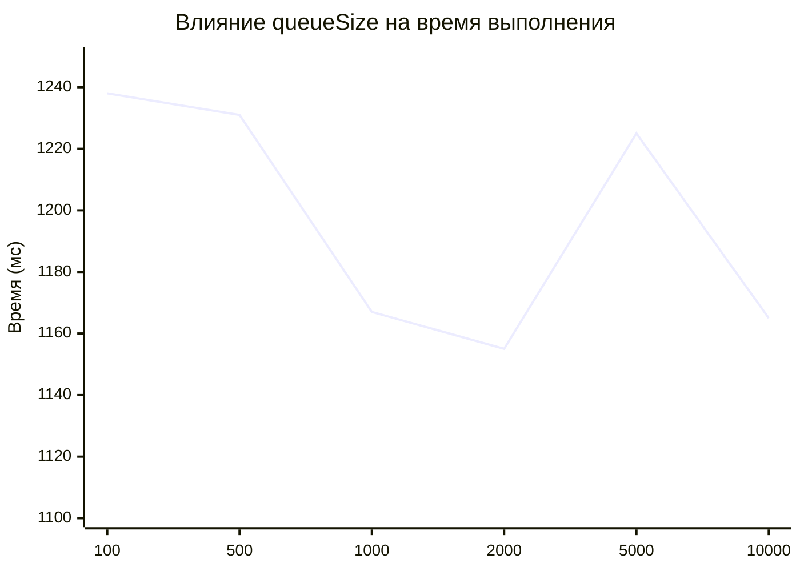
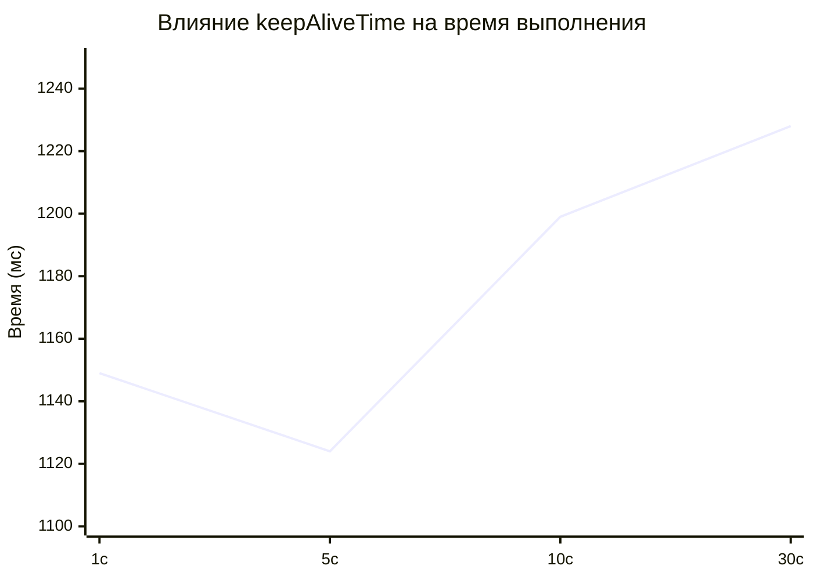
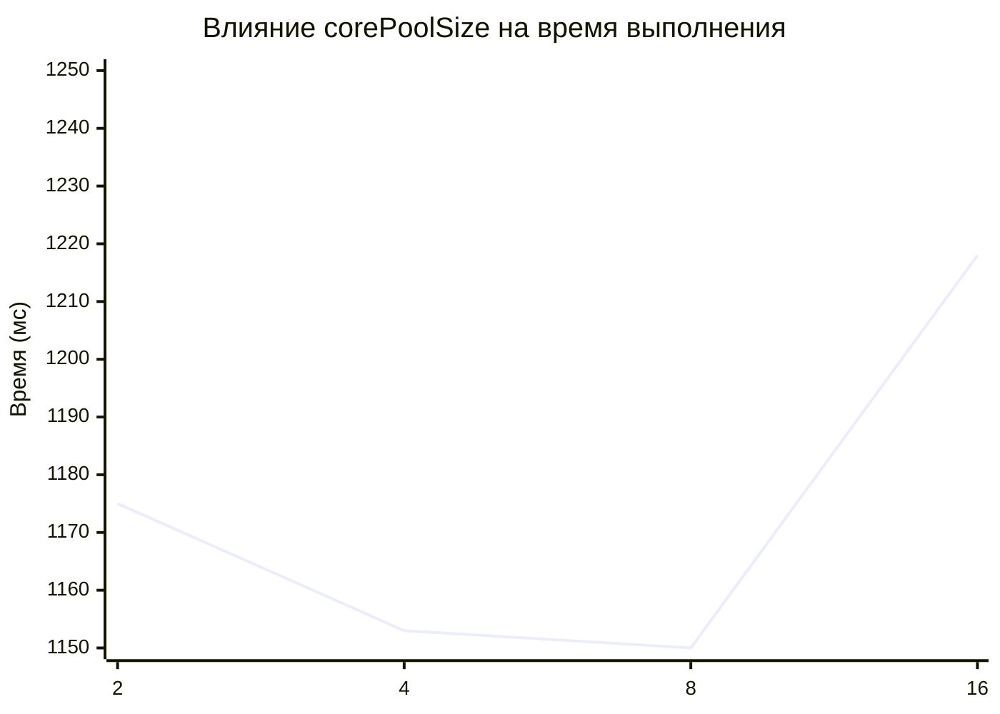
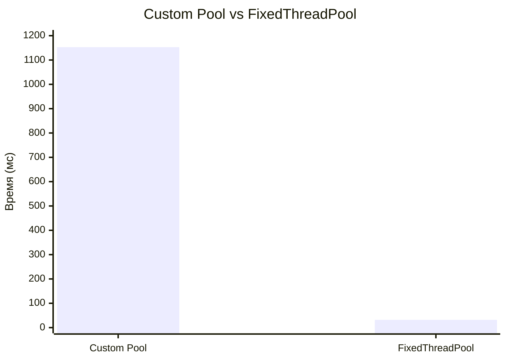

# Custom Thread Pool 

Проект по реализации масштабируемого пула потоков с несколькими очередями и адаптивным управлением.

**Custom Thread Pool** — это реализация масштабируемого пула потоков.
В отличие от стандартного `ThreadPoolExecutor`, данный пул использует архитектуру с несколькими независимыми очередями
и балансировкой нагрузки по алгоритму **Round Robin**, что позволяет эффективнее использовать ресурсы многоядерных процессоров.

## Стек технологий
* **Java 21**
* **SLF4J + Logback**
* **JUnit 5**
* **Maven**

## Параметры настройки

| Параметр | Описание |
|----------|----------|
| `corePoolSize` | Минимальное количество потоков |
| `maxPoolSize` | Максимальное количество потоков |
| `keepAliveTime` | Время простоя потока до завершения |
| `queueSize` | Размер каждой очереди |
| `minSpareThreads` | Минимальное число свободных потоков |


## Технические решения
* **Multi-Queue Architecture:** Вместо одной общей очереди использовано `maxPoolSize` отдельных `BlockingQueue`. 
Это снижает Lock Contention (конкуренцию за блокировку) при высокой нагрузке.
* **Балансировка:** Реализован алгоритм **Round Robin** с защитой от переполнения счетчика.
* **minSpareThreads:** Параметр трактуется как минимальное число свободных потоков. 
Если их меньше, пул создает новый поток (до достижения `maxPoolSize`).
* **Политика отказа (Caller-Runs):** Если все очереди полны, задача выполняется в потоке, который её прислал. 
Это предотвращает потерю задач и замедляет слишком быстрого отправителя.


### Почему выбрана Caller-Runs?
**Преимущества:**
- Гарантирует выполнение каждой задачи (ни одна не теряется)
- Создает естественное давление на отправителя (backpressure)
- Простота реализации и понимания
- Не требует дополнительных очередей для отброшенных задач

**Недостатки:**
- Может заблокировать вызывающий поток на долгое время
- Не подходит для задач с длительным выполнением
- Может привести к неожиданным задержкам в вызывающем коде
- При пиковой нагрузке вызывающий поток может выполнять чужие задачи


## Принцип распределения задач
При поступлении новой задачи:
1. **Round Robin балансировка**: задачи распределяются по кругу между всеми очередями
2. **Защита от переполнения**: используется `(counter.getAndIncrement() & Integer.MAX_VALUE) % queues.size()`
3. **Привязка потоков**: каждый рабочий поток закреплен за конкретной очередью и забирает задачи только из неё
4. **Caller-Runs при переполнении**: если выбранная очередь полна, задача выполняется в текущем потоке

Это обеспечивает:
- Равномерную загрузку всех очередей
- Отсутствие "голодающих" потоков
- Естественное backpressure при перегрузке


## Анализ производительности

### Методика тестирования
Сравнение проводилось на локальной машине (CPU 12 ядер).
* **Количество задач:** 100 000
* **Инструмент:** ParameterBenchmark.java

### Результаты бенчмарка

#### Влияние queueSize
| queueSize | Время (мс) | Задач/сек |
|:---------:|-----------:|----------:|
| 100 | 1238 | 80 775 |
| 500 | 1231 | 81 234 |
| 1000 | 1167 | 85 689 |
| 2000 | 1155 | 86 580 |
| 5000 | 1225 | 81 632 |
| 10000 | 1165 | 85 836 |

**Оптимум:** 1000-2000 задач

#### Влияние keepAliveTime
| keepAliveTime (с) | Время (мс) | Задач/сек |
|:-----------------:|-----------:|----------:|
| 1 | 1149 | 87 032 |
| 5 | 1124 | 88 967 |
| 10 | 1199 | 83 402 |
| 30 | 1228 | 81 433 |

**Оптимум:** 5 секунд

#### Влияние corePoolSize
| corePoolSize | maxPoolSize | Время (мс) | Задач/сек |
|:------------:|:-----------:|-----------:|----------:|
| 2 | 4 | 1175 | 85 106 |
| 4 | 8 | 1153 | 86 730 |
| 8 | 16 | 1150 | 86 957 |
| 16 | 32 | 1218 | 82 102 |

**Оптимум:** количество ядер CPU

#### Сравнение со стандартным пулом
| Пул | Конфигурация | Время (мс) | Задач/сек |
|-----|--------------|-----------:|----------:|
| Custom Thread Pool | 4/8/1000/1 | 1153 | 86 730 |
| FixedThreadPool | 8 потоков | 32 | 3 125 000 |


## Анализ полученных результатов:

* Кастомный пул показал ожидаемо более низкую производительность (примерно в 36-38 раз медленнее) на пустых задачах по следующим причинам:
* Детальное логирование — каждое событие (прием задачи, выполнение, завершение) логируется, что создает дополнительную нагрузку
* Распределение по очередям — Round Robin требует атомарного инкремента счетчика для каждой задачи
* Проверка minSpareThreads — стрим-операция для подсчета свободных потоков
* Caller-Runs политика — при переполнении задача выполняется в вызывающем потоке
* Multi-queue архитектура — дополнительные проверки при распределении задач


## Исследование параметров

### Влияние queueSize
| queueSize | Поведение |
|-----------|-----------|
| 100 | Частые Caller-Runs, производительность 80 775 задач/сек |
| 1000-2000 | Оптимальный баланс: 85 000+ задач/сек |
| >5000 | Избыточное потребление памяти без прироста производительности |

### Влияние keepAliveTime
| keepAliveTime | Поведение |
|---------------|-----------|
| 1с | Частое создание/уничтожение потоков |
| 5с | Максимальная производительность: 88 967 задач/сек |
| >10с | Удержание неиспользуемых потоков в памяти |

### Влияние minSpareThreads
| Значение | Поведение |
|----------|-----------|
| 0 | Максимальная производительность (87 183 задач/сек), но задержки при старте |
| 1-2 | Оптимально для большинства приложений |
| >3 | Избыточное потребление памяти без прироста производительности |

**Оптимум:** 0-1 поток (согласно замерам, значение 0 показало лучший результат)

## Полные данные замеров
* Все результаты измерений доступны в файле thread_pool_benchmark.csv


## Визуализация результатов

### Влияние размера очереди на производительность



**Анализ:** Минимальное время (1155 мс) достигается при queueSize = 2000. Оптимальный диапазон: 1000-2000.

### Влияние времени простоя на производительность



**Анализ:** Пик производительности (1124 мс) при keepAliveTime = 5 секунд.

### Влияние количества потоков на производительность



**Анализ:** Оптимум при 8 потоках (1150 мс) - соответствует числу ядер CPU.

### Сравнение Custom Pool vs FixedThreadPool



**Анализ:** FixedThreadPool быстрее в ~36 раз на простых задачах.

## Инструкция по запуску
1. Быстрая проверка компиляции: `mvn clean compile`
2. Запуск демонстрационной программы: `mvn exec:java -Dexec.mainClass="ru.custompool.Main"`
3. Запуск бенчмарка: `mvn exec:java -Dexec.mainClass="ru.custompool.BenchmarkMain"`
4. Запуск тестов: `mvn test`

или

1. Полная сборка с тестами и созданием JAR: `mvn clean package`
2. Запуск демо из собранного JAR: `java -jar target/custom-thread-pool-1.0-SNAPSHOT.jar`


## Примеры логирования

```
Создание потока (ThreadFactory)
[ThreadFactory] Creating new thread: MyPool-worker-1

Прием задачи
[Pool] Task accepted into queue #3

Выполнение задачи
[Worker] MyPool-worker-2 executes task from queue #1

Отказ (Caller-Runs)
[Rejected] Queue #5 full. Caller-Runs activated.

Idle timeout
[Worker] MyPool-worker-4 idle timeout, stopping.

Завершение
[Worker] MyPool-worker-1 terminated.
```

## Выводы

1. **Multi-Queue архитектура** работает, но уступает в производительности стандартному пулу (медленнее в ~36-38 раз на простых задачах) из-за следующих факторов:
  - Детальное логирование каждого события через SLF4J
  - Round Robin распределение с атомарными операциями для каждой задачи
  - Стрим-операции для проверки minSpareThreads
  - Caller-Runs политика при переполнении очередей

2. **Caller-Runs политика** гарантирует выполнение всех задач, создавая естественный backpressure, что критично для систем, где недопустима потеря задач

3. **Оптимальные параметры** для данной реализации на основе проведенных замеров:
  - `queueSize = 1000-2000` (пиковая производительность 86 580 задач/сек)
  - `keepAliveTime = 5 секунд` (максимальная производительность 88 967 задач/сек)
  - `corePoolSize = количество ядер CPU` (8 потоков дают 86 957 задач/сек)
  - `minSpareThreads = 0-1` (значение 0 показало лучший результат)

4. **Область применения** — системы, где важнее надежность и мониторинг, чем максимальная производительность. Данный пул предоставляет:
  - Полную visibility состояния через логирование
  - Гарантированное выполнение всех задач
  - Детальную статистику работы
  - Гибкую настройку под различные сценарии